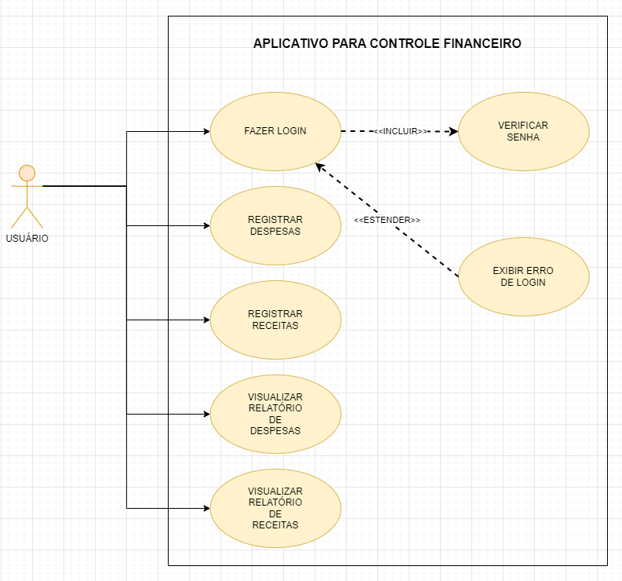

# Especificações do Projeto

A definição exata do problema e os pontos mais relevantes a serem tratados neste projeto foi consolidada com a participação dos usuários em um trabalho de imersão feita pelos membros da equipe a partir da observação dos usuários em seu local natural e por meio de entrevistas. Os detalhes levantados nesse processo foram consolidados na forma de personas e histórias de usuários. 

## Personas

|Maria Joana de Santos||
|---|---| 
|Idade: 32 anos|Ocupação: Chef de Cozinha|
|Motivações: | <ul><li>Possui problemas financeiros</li><li> Não consegue economizar para uma viagem de curto prazo</li></ul>|
|Hobbies:|<ul><li>Pescar</li><li>Ir a shows</li></ul>|

|João Carlos da Silva||
|---|---| 
|Idade: 44 anos|Ocupação: Vendedor|
|Motivações: | <ul><li>Possui dívidas e quer identifar onde pode reduzir seus gastos</li><li> <ul><li>Está tendo gastos maiores que sua renda </li><li>|
|Hobbies:|<ul><li>Viajar</li><li>Pescar</li></ul>|

|Eduardo Navares||
|---|---| 
|Idade: 28 anos|Ocupação: Scrum Master|
|Motivações: | <ul><li> Acredita que pode poupar mais</li><li> Desconhece as suas despesas</li><li>
|Hobbies:|<ul><li>Jogar basquete</li><li>Ir ao parque</li></ul>|

|Gil Costa||
|---|---| 
|Idade: 46 anos|Ocupação: Médico|
|Motivações: | <ul><li>Possui vários gastos imprevisíveis</li><li> Deseja ter um controle sobre suas finanças pessoais</li></ul>|
|Hobbies:|<ul><li>Esquiar </li><li>Tocar guitarra</li></ul>|

## Histórias de Usuários

Com base na análise das personas forma identificadas as seguintes histórias de usuários:

|EU COMO... `PERSONA`| QUERO/PRECISO ... `FUNCIONALIDADE` |PARA ... `MOTIVO/VALOR`                 |
|--------------------|------------------------------------|----------------------------------------|
| Maria Joana de Santos  |	Cortar despesas                   |	Para que realize uma viagem de férias  |
| João Carlos da Silva | Identificar aonde pode cortar suas despesas   | Acabar com suas dívidas          |
| Eduardo Navares  | Identificar suas despesas e receitas      | Juntar mais dinheiro                 |
| Gil   Costa   | Possuir um histórico das suas finanças     | Ter previsibilidade dos seus gastos |

## Requisitos

O escopo funcional do projeto é definido por meio dos requisitos funcionais que descrevem as possibilidades interação dos usuários, bem como os requisitos não funcionais que descrevem os aspectos que o sistema deverá apresentar de maneira geral. Estes requisitos são apresentados a seguir.

### Requisitos Funcionais

A tabela a seguir apresenta os requisitos do projeto, identificando a prioridade em que os mesmos devem ser entregues.

|ID    | Descrição do Requisito  | Prioridade |
|------|-----------------------------------------|----|
| RF-001 | A aplicação deve apresentar a funcionalidade do usuário  adicionar custos/despesas individuais        | ALTA | 
| RF-002 | A aplicação deve apresentar a funcionalidade do usuário  adicionar receitas individuais               | ALTA |
| RF-003 | A aplicação deve apresentar a possibilidade do usuário  adicionar setores de despesas                 | ALTA |
| RF-004 | A aplicação deve apresentar a possibilidade do usuário adicionar setores de receitas                  | ALTA |
| RF-005 | A aplicação deve realizar a soma de todos setores de despesas de um lado da tela                      | ALTA |
| RF-006 | A aplicação deve realizar a soma de todos setores de receitas de um lado da tela                      | ALTA |
| RF-007 | A aplicação deve possuir uma área de login para que o usuário possa entrar na sua área de dados financeiros           | MÉDIA |
| RF-008 | A aplicação deve possuir uma tela visual apresentando comparativos entre dias, meses e mais estatísticas sobre os dados apresentados | ALTA |
| RF-009 | A aplicação deve possuir uma lupa para encontrar alguma receita ou despesa específica | MÉDIA |
| RF-010 | A aplicação deve possuir a possibilidade de editar meses anteriores  | MÉDIA |
| RF-011 | A aplicação deve possuir uma tela comparando todos os usuários da plataforma e suas despesas deixando em valores percentuais |BAIXA|

### Requisitos não Funcionais

A tabela a seguir apresenta os requisitos não funcionais que o projeto deverá atender.

|ID     | Descrição do Requisito  |Prioridade |
|-------|-------------------------|----|
|RNF-001| O site da aplicação deve ser responsivo | ALTA | 
|RNF-002| O site da aplicação deve ser compatível com os principais celulares androids de última geração | ALTA | 
|RNF-004| O site da aplicação deve utilixar a linguagem Javascript | ALTA |
|RNF-005| O site da aplicação deve utilizar o banco de dados SQL | MÉDIA |

## Restrições

As questões que limitam a execução desse projeto e que se configuram como obrigações claras para o desenvolvimento do projeto em questão são apresentadas na tabela a seguir. 

|ID   | Restrição                                             |
|-----|-------------------------------------------------------|
|RE-01| O projeto deverá ser entregue no final do semestre, não podendo extrapolar a data de 05/06/2023 |
|RE-02| A equipe não pode subcontratar uma empresa para ajudar a desenvolver o design do aplicativo |
|RE-03| A equipe não pode subcontratar uma empresa para a criação do conteúdo do aplicativo |
|RE-04| A aplicação só poderá ser lançado se os requisitos de funcionalidade e acessibilidade quando forem atendidas |

## Diagrama de Casos de Uso

